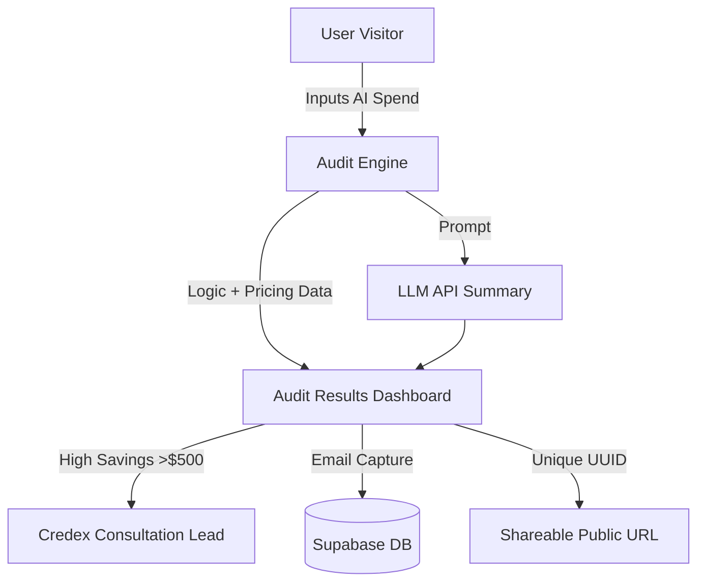

# System Architecture

## Data Flow Diagram

Tech Stack Details
Frontend: React 19 + TypeScript + Tailwind 4.

Backend/DB: Supabase (PostgreSQL) for real-time lead capture.

Utilities: Lucide-React (Icons), React Hot Toast (Notifications).

Report Generation: jsPDF & html2canvas (Upcoming feature).